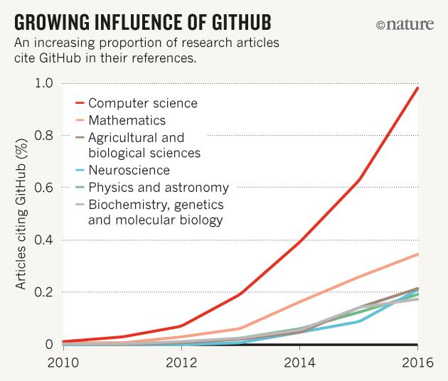
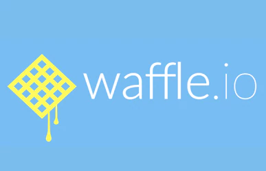

@title[Introduction]


# Managing software in Research

Dr Paddy Tobias, eResearch Analyst

Intersect Australia

---
- Software = `source code`
- i.e., text file programs

---
## Software in Research: Context

- Increasing support for research data
- Still little support for research software code
- But software management tools on the rise in research


---
## Why manage your code?

- Improving your workflow |
- Coordinating group research |
- Scientific reproducibility |
- External engagement |
- Co-authorship opportunities |

+++



[Democratic databases: science on GitHub](https://gitpitch.com/paddytobias/research-software-management#/9/1)

+++

|Mention type|Count (%)|
|--|--|--|
|Cite s.w. publication|105 (37%)|
|In-text s.w. name only|90 (31%)|
|Instrument s.w.|53 (19%)|
|Cite project name or website|15 (5%)|
|Cite s.w. URL|13 (5%)|
|Cite user’s manual|6 (2%)|
|Not even name|4 (1%)|

<p style="text-align:right">*n* = 286</p> 

<DIV ALIGN=CENTER>Read: [Software in the scientific literature]("https://gitpitch.com/paddytobias/research-software-management#/9/1")</DIV>

+++ 

Things to consider:
- Writing your code |
- Version control |
- Managing contributions |
- Develop documentation |
- Issues register |
- Licensing |

+++

## How to manage your code?


### Git, GitHub, GitLab, Git-everything...


[More options here...](https://software.ac.uk/resources/guides/choosing-repository-your-software-project)

Note:
Alternative code repositories:
- BitBucket
- SourceForge

---

```
if <<CODING BY/FOR YOURSELF>>:


    then ...
```
+++

### Version control
- Set version control up as the first thing you do |
- Make regular commits |
- Meaningfully describe major commits, not every commit |
- Most repos have a two step process to safe-guard from errors |

<iframe class="stretch" data-src="https://swcarpentry.github.io/git-novice/fig/git-staging-area.svg"></iframe>

+++

### Writing your code
- Where possible look for open source code to work from
- However, if **adapting** code from someone else, **best not to**. Write you're own and copy/paste the chunks you want |
- Have a plan for your code before you start writing. What do you want the code to achieve? |
- Draw your plans... before you write your code. Starting point: What are your inputs and outputs? |
- Add comments to your code as write |

Note: 
* there are formal design architecutres you can follow (e.g., Unified Modeling Language), but you don't have to use/learn these. Just come up with a conceptual way to explain what you what your program.
* more so, draw these concepts before you begin coding. 
* take into account your inputs and outputs. what goes into your program and what do you want to come out

---

```
else if <<COLLABORATING WITH OTHERS>>:


    then ...
```

+++
### Managing contributions
Git has many ways to manage contributions:
- only owners can make changes, but everyone else can recommend changes. i.e., `pull request` 
- each change is identified and marked with a unique id, meaning that you can rollback to previous versions
- repos can be `forked` and `merged`, `upstream` and `downstream`


+++ 

### Documentation 

- Create a README.md file for every project |
- Learn Markdown |
- Use Atom |
- Consider user guides as well (e.g., for installing, use, examples) |

Note: 
use Atom

+++ 


### Issues register and Project management

- See software development as a project
- Allow team mates or public to register issues
- Track the resolution of these issues on [Waffle.io](https://waffle.io)

Note:

https://waffle.io/paddytobias/research-software-management


---

```
else if <<PUBLISHING YOUR CODE>>:


    then ...
```
+++


### Software Citation Principles

1. legitimate and citable research product
2. gives scholarly credit
3. citations should use unique identifiers
4. persistant unique identifiers (e.g., DOIs)
5. facilitate access to the software
6. specify the version

Note: 
1. considered a legitimate and citable product of research
2. facilitates giving scholarly credit, attribution to all contributors
3. citations should have recognized unique identifiers, machine actionable, interoperable
4. unique identifiers and metadata describing the software should persist
5. citations should facilitate access to the software and use of it
6.  citations should specify the version that was used


+++
### Software citation and licensing


* Zenodo allows you to archive your code with them
* In turn Zenodo will issue you a Digital Object Identifier for the collection

READ: [Making your Code Citable](https://gitpitch.com/paddytobias/research-software-management#/9/1)

+++
### Reproducible research...

(https://www.researchinformation.info/news/cambridge-university-press-partners-code-ocean)

+++
### Code Ocean

<iframe class="stretch" data-src="https://codeocean.com/"></iframe>


---

## Git vocabulary

```
git push  <REMOTENAME> <BRANCHNAME>
git clone https://github.com/<USERNAME>/<REPOSITORY>.git 
git fetch <REMOTENAME> 
git merge <REMOTENAME>/<branchname>
git pull <REMOTENAME> <branchname>
```
@[1](`push` to push or publish commits to your code repository)
@[2](`clone` to grab a complete copy of another user's repository)
@[3](`fetch` to retrieve new work done by other people)
@[4](`merge` combines your local changes with changes made by others)
@[5](`pull` completing both *git fetch* and *git merge* in the same command)

---

## Benefits
- Research Impact and Engagement: who are your end users?


---
## Where to next?

Come to the class next week: 9.30-12.30, 8th May

Code for this presentation: [github.com/paddytobias/research-software-management](github.com/paddytobias/research-software-management)

+++
## Reference list

<p><font size="3">GitHub, 2016 "Making your Code Citable", https://guides.github.com/activities/citable-code/</font></p>

<p><font size="3">Howison, J, Bullard, J, "Software in the Scientific Literature: Problems with Seeing, Finding, and Using Software Mentioned in the Biology Literature", *Journal of the Assoc. for Information Science and Technology*, 67(9), 2137-2155, https://onlinelibrary.wiley.com/doi/abs/10.1002/asi.23538</font></p>

<p><font size="3">Perkel, J, "Democratic databases: science on GitHub", *Nature* 538, 127–128, October 6, 2016, doi:[10.1038/538127a](https://www.nature.com/news/democratic-databases-science-on-github-1.20719)</font></p>

<p><font size="3">Smith, AM, Katz, DS, Niemeyer, KE, FORCE11 Software Citation Working Group, 2016,  "Software citation principles", *PeerJ Computer Science*, 2(86) https://doi.org/10.7717/peerj-cs.86</font></p>


