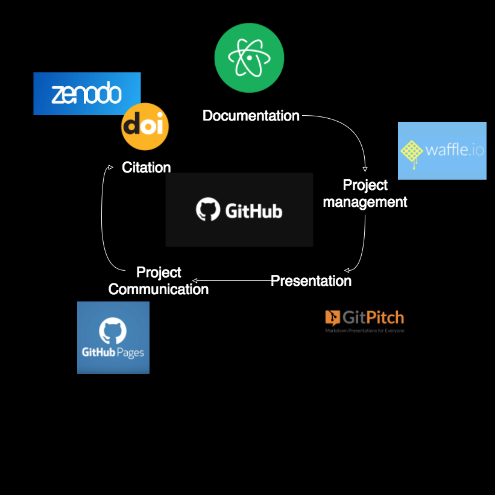
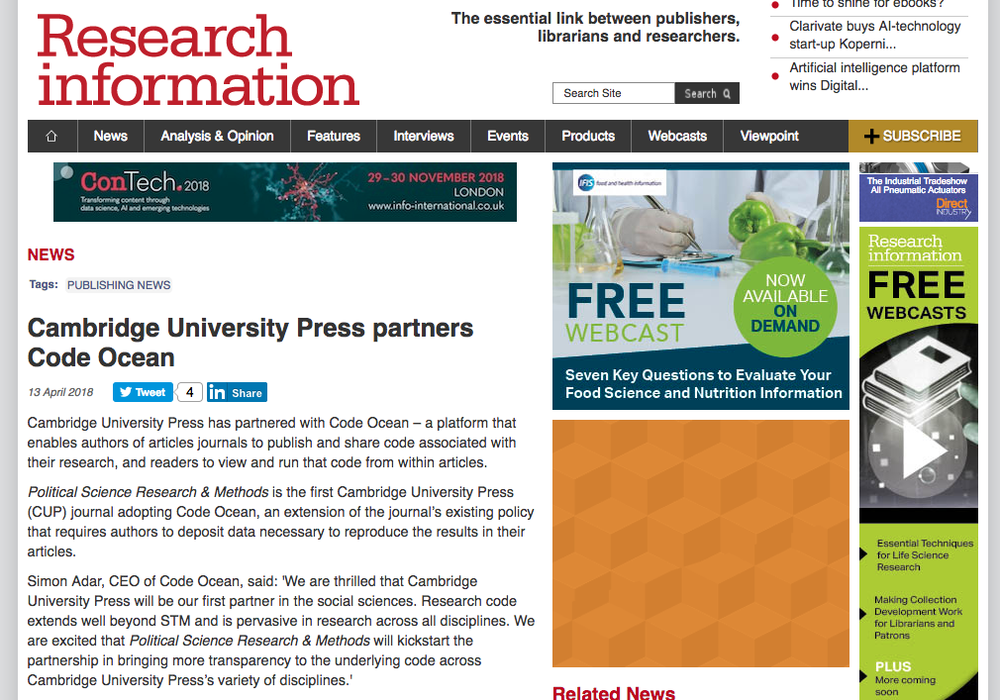

@title[Introduction]

# Software in Research

Dr Paddy Tobias, eResearch Analyst

---

Software = `source code`

`i.e., text file programs, creative pieces of work!`

"... if the specific software is important to the research outcome, for example if different software could produce different data or results, then the software is research software."  [CodeMeta](https://github.com/codemeta/codemeta-paper/blob/master/codemeta-paper.Rmd)
---
## Context

- Increasing support for research data in universities and academia |
- Still little support for research software code |
- But software and software management tools on the rise in research |

+++

### 2000-2010 Biology journal articles

*articles* = 91; *mentions* = 286

|Mention types|Count (%)|
|--|--|--|
|Cite s.w. publication|105 (37%)|
|In-text s.w. name only|90 (31%)|
|Instrument s.w.|53 (19%)|
|Cite project name or website|15 (5%)|
|Cite s.w. URL|13 (5%)|
|Cite user’s manual|6 (2%)|
|No name|4 (1%)|

READ: [Software in the scientific literature]("https://gitpitch.com/paddytobias/research-software-management#/9/1")

Note:
* from 91 randomly selected Biology articles published between 2000-2010
* 59 had a mention of software in some form or another

+++

READ: [Democratic databases: science on GitHub](https://gitpitch.com/paddytobias/research-software-management#/9/1)

---
## What more to do?

- Improve understanding of management techniques |
- Establish standard solutions: archive, index, share, discover and attribute |
- Standardise software metadata |
- Promote Scientific reproducibility |
- Promote Engagement opportunities |

+++

## Software and Data: what's the difference?
* Software is active; data is (usually) static |
* Software has versions, more so than data |
* Software describes workflow and methods |
* Software more likely to have dependencies |
* Software tends to need ongoing maintenance |

[D Katz, Software vs Data](https://github.com/danielskatz/software-vs-data)

+++

### Current movements
## Working groups
* Force 11 Software Citation Implementation Group and [software citation principles](https://doi.org/10.7717/peerj-cs.86)
* [RD-Alliance Interest Group](https://www.rd-alliance.org/groups/software-source-code-ig)
* ANDS Software citation group

+++
### Software Citation Principles

* legitimate and citable research product |
* gives scholarly credit |
* citations should use unique identifiers |
* persistent unique identifiers (e.g., DOIs) |
* facilitate access to the software |
* specify the version |

Note:
1. considered a legitimate and citable product of research
2. facilitates giving scholarly credit, attribution to all contributors
3. citations should have recognised unique identifiers, machine actionable, interoperable
4. unique identifiers and metadata describing the software should persist
5. citations should facilitate access to the software and use of it
6.  citations should specify the version that was used

+++

### Other Current movements
## DataCite

[Metadata Schema 4.1](https://schema.datacite.org/meta/kernel-4.1/doc/DataCite-MetadataKernel_v4.1.pdf) - [Example](http://schema.datacite.org/meta/kernel-4.1/example/datacite-example-software-v4.1.xml)

Introducing:
* `HasVersion`
* `IsVersionOf`
* `IsRequiredBy`
* `Requires`

Note:
* This release is backward compatible and introduces a number of schema and documentation (DataCite Metadata Working Group, 2017) enhancements to make software citation easier and clearer.  For example, the 4.1 documentation includes a special “pull-out” appendix to assist those using the schema to register software. Please read all about it here: https://blog.datacite.org/metadata-schema-4-1/.

+++
### Other Current movements
## CodeMeta Project

* A joint project by several science and industry actors to create minimal metadata schemas for science software and code.

* ... not intended to be yet another standard, but rather a crosswalk that allows interoperability ... to exchange software metadata.

+++
### Other Current movements
## Software Heritage [[Under Development]]
A persistent archive for all open source software, holding 83 million software projects, 4.5 billion source files.

If you have source code on GitHub, it's probably in there.

Note:
The project came about because software code is seen as being even more vulnerable to corruption and obsolescence than typical archival holdings like books and other media like video and film.

* *Heritage* - Software is an important part of human production -> collect, preserve, make accessible
* *Science* - To guarantee scientific reproducibility we need to preserve it -> reproducibility
* *Industry* - Software is present in all industrial processes and products -> provenance tracking

+++

## Communities promoting software citation
* ESIP Software and service citation (origin in NASA)|
* Working Towards Sustainable Software For Science (WSSSPE) |
* US Research Software Sustainability Institute (URSSI, NSF funded) |
* [UK Software Sustainability Institute](https://www.software.ac.uk/)
* [Journal of Open Source Software](http://joss.theoj.org/)
* GeoScience Australia
* CSIRO

---

## How to manage code?
### Git, GitHub, GitLab, Git-everything...

[More options here...](https://software.ac.uk/resources/guides/choosing-repository-your-software-project)

Note:
Alternative code repositories:
- BitBucket
- SourceForge

+++

Note:
Project mngmnt
https://github.com/paddytobias/surveying-with-qualtrics/issues
https://waffle.io/paddytobias/surveying-with-qualtrics

citation
https://github.com/paddytobias/15census_timor_dataclean
https://zenodo.org/record/826449#.Wt5zkBNL9E9

+++
### Recent news: Reproducible research...

(https://www.researchinformation.info/news/cambridge-university-press-partners-code-ocean)

+++
### Code Ocean

[Code Ocean](https://codeocean.com/)

---
## Benefits
- Research Impact and Engagement |
  - engaging with end users |
  - tracking engagement |
- Global collaborations |
- More recognition for NTROs |
- Reproducible research and the new age of research |

---
## Where to next?

- Intersect runs Git training at UNE |
- Developing central support for software management |
- Promoting software management skills |
- Considering a single repository at UNE |
- Supporting software research outputs in the repository |

+++
## Reference list

ANDS 2018, [References to Software Description and citation]("https://docs.google.com/document/d/18bBKQCTYKUT8RtTQYvxnvDGEeq8UVhPN3fmK2g9M71c/edit")

GitHub, 2016 "Making your Code Citable", https://guides.github.com/activities/citable-code/

Howison, J, Bullard, J, "Software in the Scientific Literature: Problems with Seeing, Finding, and Using Software Mentioned in the Biology Literature", *Journal of the Assoc. for Information Science and Technology*, 67(9), 2137-2155, https://onlinelibrary.wiley.com/doi/abs/10.1002/asi.23538

Katz, D, "Software vs Data", *GitHub*, [https://doi.org/10.7287/peerj.preprints.2630v1](https://github.com/danielskatz/software-vs-data)

Perkel, J, "Democratic databases: science on GitHub", *Nature* 538, 127–128, October 6, 2016, doi:[10.1038/538127a](https://www.nature.com/news/democratic-databases-science-on-github-1.20719)

Smith, AM, Katz, DS, Niemeyer, KE, FORCE11 Software Citation Working Group, 2016,  "Software citation principles", *PeerJ Computer Science*, 2(86) https://doi.org/10.7717/peerj-cs.86

Code for this presentation: [github.com/paddytobias/research-software-management]("github.com/paddytobias/research-software-management/eResearchCommittee")

